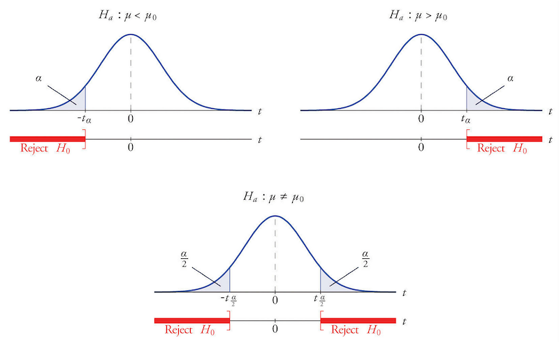

## Hypothesis testing

### The birth problem {.unnumbered}

Hypothesis testing allows us to test specific hypothesis about a population 
parameter with the evidence obtained from a sample. 
The earliest use of statistical hypothesis testing is
generally credited to the question of whether male and female births are
equally likely (null hypothesis), which was addressed in the 1700s by
John Arbuthnot and later by Pierre-Simon Laplace.

Let $p$ be the population ratio (defined as the ratio of boys to the
total number of babies). We hypotheses that $$H_{0}:p=0.5$$ This is
called the **null hypothesis**, which is the hypothesis we want to test.
If the null hypothesis is false, we have $$H_{1}:p\neq0.5$$ This is
called the **alternative hypothesis**. How am I able to test which
hypothesis is true? I can answer this question by collecting a small
sample. Suppose I have collected a sample of $50$ babies computed a
sample ratio of $\hat{p}=0.55$. Does it prove or disprove the
hypothesis?

Note that the ratio $\hat{p}$ can be regarded as a sample mean. Let
$X_{i}$ be a random variable that equals $1$ if the $i$-th baby is a boy
and $0$ otherwise. Then, $\hat{p}=\frac{1}{n}\sum_{i=1}^{n}X_{i}$. The
variance of $\hat{p}$ is given by
$$Var(\hat{p})=\frac{1}{n^{2}}\sum_{i=1}^{n}Var(X_{i})=\frac{p(1-p)}{n}$$
since $X_{i}$ is a Bernoulli random variable. By the Central Limit
Theorem, we have $$\frac{\hat{p}-p}{\sqrt{\frac{p(1-p)}{n}}}\to N(0,1)$$
Suppose $H_{0}$ is true, then we know the distribution of $\hat{p}$. In
particular, there is 95% chance that $\hat{p}$ would be in the interval
$$p\pm1.96\sqrt{\frac{p(1-p)}{n}}=0.5\pm0.14$$ Our observed sample mean
$\hat{p}=0.55$ is not outrageous. It is well within this interval. [That
means the evidence is not against the null hypothesis.]{.underline} It
does not mean $H_{0}$ is true. But it is reasonable given we have
observed a sample mean $\hat{p}=0.55$.

Suppose we have observed $\hat{p}=0.65$. This piece of evidence does not
seem to be consistent with the null hypothesis. Because if $H_{0}$ is
true, we only have less than 5% chance of observing this sample mean. It
is extremely unlikely. Based on this sample, we are more inclined to
reject the $H_{0}$. Rejecting the null hypothesis does not mean it is
false, [but it means our evidence does not support this
hypothesis.]{.underline}

### Definitions {.unnumbered}

::: {#def-hypothesis}
### Hypothesis testing
A **null hypothesis** ($H_0$) is a statement that there is no relationship
or effect between variables. An **alternative hypothesis** ($H_1$) is the
opposite of the null hypothesis. Hypothesis testing seeks to find evidence
to reject the null. 
:::

::: {#def-powerfun}
### Power function
In a hypothesis testing about a parameter $\theta$, let the null hypothesis be
$$H_0: \theta = \theta_0$$
The power function, $\pi(\theta)$ is a function that gives the probability of 
rejecting the null hypothesis when it is true.
:::

::: callout-tip
### An ideal test
An ideal test would be:  $\pi(\theta_0) = 0$, and $\pi(\theta)=1$.
for any $\theta \leq\theta_0$. That is, the test never makes a mistake.
But in reality, a test always involves errors.
:::

::: {#def-type12error}
### Type I/II error
A **Type I error** is rejecting the $H_0$ when it is true, whose probability 
is given by $$\alpha = \pi(\theta_0).$$
A **Type II error** is failing to reject the $H_0$ when it is false, whose 
probability is given by $$\beta = 1- \pi(\theta).$$
:::

::: callout-tip
### Type I/II error
|     |                  | Reject $H_{0}$ | Fail to reject $H_{0}$ |
|-----|------------------|:--------------:|------------------------|
|     | $H_{0}$ is true  |  Type I error  | $\checkmark$           |
|     | $H_{0}$ is false |  $\checkmark$  | Type II error           |
:::

::: {#def-siglevel}
### Significance level
Significance level is the probability of making a Type I error, that is the $\alpha$.

In a hypothesis testing, we typically want to control the Type I error. 
That is we want to make sure that when we reject the null, 
the chance of being wrong is small. 
Typically, we restrict $\alpha$ to a very small value, such as 
$\alpha = 0.1, 0.05, 0.01$.
:::

::: {#def-pvalue}
### p-value
The probability of observing a test statistic as extreme as, or more extreme than, 
the one calculated from the sample data, assuming $H_0$ is true.
A small $p$-value provides strong evidence *against* $H_0$.
:::

::: {#def-decision}
### Decision rule
We reject the null hypothesis ($H_0$) under a given significance level ($\alpha$)
if $p \leq \alpha$. We say a result is **statistically significant**, by the standards 
of the study, when $p \leq \alpha$.
:::

{width="80%" fig-align="center"}

### Testing the sample mean {.unnumbered}

Tom is 185 (cm) tall and he wants to know if he is taller than the average male ($\mu$). 

**Formulating hypothesis:**
$$\begin{aligned}
H_0:\ & \mu = 185 \\
H_1:\ & \mu < 185 \\
\end{aligned}$$

**Constructing test statistics:**
$$T = \frac{\bar{X}-\mu}{s/\sqrt{n}}$$

**Computing test statistics and p-value:**

```{r}
# load dataset
data <- read.csv("../dataset/survey.csv")

# extract heights of males
H <- data[data$Gender == 'M', 'Height']

# conducting t-test
T <- (H - 185)/(sd(H)/sqrt(length(H)))
t <- t.test(T, alternative = 'less')

# report results
cat("t-stat:", t$statistic, "p-value:", t$p.value)
```

**Making decision:**

We adopt significance level $\alpha=0.05$. 
Because $p<\alpha$, we reject the $H_0$ and accept $H_1$. 
We thus conclude Tom is **significantly** taller than the average.

::: callout-tip
### Why t-test?
By convention, we would like to use a $t$-test. For large samples, $t$-statistic 
converges to standard normal. So it is equivalent to conducting $z$-test under CLT.
For small samples, $t$-test is valid if the sample is drawn from a normal distribution. 
:::

### Comparing two sample means {.unnumbered}

Are male students on average do better in exams than female students? 
(or the other way around)

**Formulating hypothesis:**
$$\begin{aligned}
H_0:\ & \mu_1 = \mu_2 \\
H_1:\ & \mu_1 \neq \mu_2 \\
\end{aligned}$$

**Constructing test statistics:**
$$T = \frac{\bar{X}_1-\bar{X}_2}{\sqrt{\frac{s_1^2}{n_1} + \frac{s_2^2}{n_2}}}$$

**Computing test statistics and p-value:**

```{r}
# load dataset
data <- read.csv("../dataset/survey.csv")

# extract heights of males
H1 <- data[data$Gender == 'M', 'Score']
H2 <- data[data$Gender == 'F', 'Score']

# conducting t-test
t <- t.test(H1, H2, alternative = 'two.sided')

# report results
cat("t-stat:", t$statistic, "p-value:", t$p.value)
```

**Making decision:**

We adopt significance level $\alpha=0.05$. 
Because $p>\alpha$, we fail to reject the $H_0$.
We thus conclude the average score of male students is 
**not significantly different** from females.

### Goodness-of-fit test {.unnumbered}

Purpose: Decide if the values of a categorical variable abide to certain frequencies.
For example, are people equally likely to be introverts and extroverts? 

**Formulating hypothesis:**
$$\begin{aligned}
H_0:\ & p_1 = p_2 = \frac{1}{2} \\
H_1:\ & p_2 \neq p_2 \\
\end{aligned}$$

**Constructing test statistics:**
$$\chi^2 = \sum_{i=1}^{k} \frac{(O_i - Np_i)^2}{Np_i} $$

where $O_i$ is the number observations of category $i$; 
$N$ is the total number of observations. 
The test statistics asymptotically approaches a $\chi^2(k-1)$ distribution,
where $k$ is the number of categories.

**Computing test statistics and p-value:**

```{r}
# load dataset
data <- read.csv("../dataset/survey.csv")

# extract heights of males
O1 <- NROW(data[data$Type == 'E',])
O2 <- NROW(data[data$Type == 'I',]) 

# chi-square test of goodness-of-fit
x <- chisq.test(c(O1, O2), p = c(.5, .5))

# report results
cat("chisq:", x$statistic, "p-value:", x$p.value)
```

**Making decision:**

We've got $p=0.074 >0.05$, so we will not be able to reject the null 
at 5% significance level. However, the difference is significant at
10% significance level.

### Test of independence {.unnumbered}

Purpose: Decide if two variables are statistically independent. 
For example, is personality independent of gender?

```{r}
# load dataset
data <- read.csv("../dataset/survey.csv")

# contingency table
table(data$Gender, data$Type)
```


**Formulating hypothesis:**

$$\begin{aligned}
H_0:\ & \text{The two variables are independent} \\
H_1:\ & \text{The two variables are not independent} \\
\end{aligned}$$

**Constructing test statistics:**

Let $E_{i,j}$ be the "theoretical frequency" of the value in the $i$-th row
and $j$-th column. If the independent hypothesis is true, then
$$E_{i,j} = N p_{i\cdot}p_{\cdot j}$$
where $N$ is the total number of observations and
$$p_{i\cdot} = \frac{O_{i\cdot}}{N}, p_{\cdot j} = \frac{O_{\cdot j}}{N}$$
is the marginal probability of the row variable and column variable respectively.

The test statistic is
$$\chi^2 = \sum_{i=1}^r \sum_{j=1}^c \frac{(O_{i,j}-E_{i,j})^2}{E_{i,j}} $$
The test statistic is an asymptotic $\chi^2(d)$ distribution with a 
degree of freedom $d=(r-1)(c-1)$.

**Computing test statistics and p-value:**

```{r}
# contingency table
c <- table(data$Gender, data$Type)

# chi-square test of independence
x <- chisq.test(c)

# report results
cat("chisq:", x$statistic, "p-value:", x$p.value)
```

**Making decision:**

The fact that $p=0.58 >0.1$ means we are unable to reject the null even
at 10% significance level. Thus we conclude the row variable and column
variable are statistically independent.
