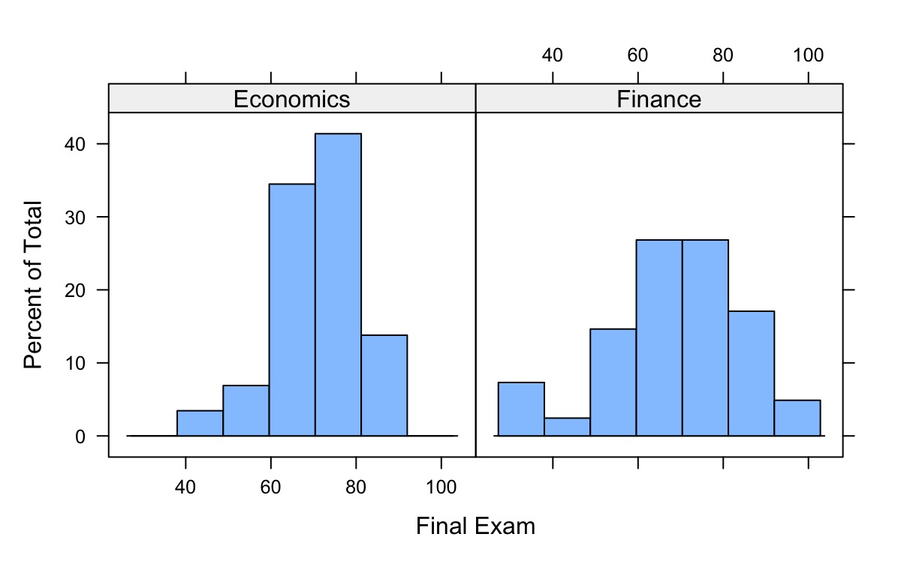

## Overview {.unnumbered}

This website contains the lecture notes of *MAT924: Probability and Statistics*
I taught at Southwest University of Finance and Economics (RIEM). 
It is an introductory probability course that aims to be not boring. 
The course emphasizes:

- Conventional teaching
- Interesting puzzles
- Data-oriented practical skills

Course Instructor's email: [gamma12\@126.com]() 
<small>(FYI: $\Gamma(1/2)=\sqrt{\pi}$)</small>

Please indicate your class and student ID when you email me.

## Syllabus

**Topic 1: Classical probabilities\
**How likely were some of your classmates born on the same day as you?

**Topic 2: Data and random variables**\
Why is your exam score in this class a random variable?

**Topic 3: Discrete distributions**\
How many earthquakes are likely to happen in a random year?

**Topic 4: Expectation and variance**\
How old are you expected to live?

**Topic 5: Continuous distributions**\
How long are you expected to wait in the queue at a restaurant?

**Topic 6: Limiting theorems**\
Why a lottery company never loses?

**Topic 7: Sampling distribution**\
How do I know I am taller than an average person?

## Assessment

**Quiz (25%).** There will be an arbitrary number of in-class quizzes.
The date for each quiz will be announced in advance. Each quiz will
consist of 1-2 questions based on material covered in previous weeks.
Every quiz is mandatory; there will be no make-up quizzes under any
circumstances.

**Project (25%).** The goal of the projects is to encourage students to
apply the knowledge learned in this course to solve practical problems.
Projects are usually open-ended and may involve data analysis,
simulations, or exploring real-world applications of probability. Essays
that present innovative perspectives and use the data persuasively to
support their conclusions will receive higher marks. Selective students
may be invited to present their findings to the class.

**Final exam (50%).** The final exam will be a closed-book,
paper-and-pencil exam scheduled on Week 17. It will not simply repeat
lecture material but will assess your ability to apply the knowledge you
have gained to solve novel problems. To perform well, you must have a
deep understanding of the concepts and acquire some degree of
problem-solving skills. The average score of the past exam is 69 with a
standard deviation 15. The pass rate (\>=60) is about 80%.

**Class participation (5%).** Additional 5 marks for class participation
on top of the above. Regular attendance and active participation in class
discussions are encouraged (though not mandatory) and will be recognized. 

{width="80%" fig-align="center"}

## Lecture notes

All lecture materials will be published through this online website. You
are not required to read any textbook. For students who insist on a
textbook, it would be DeGroot and Schervish's *Probability and
Statistics (4th edition).*

It is recommended to use the textbook as a supplement not a replacement
of the lecture note. For students who prefer to read the textbook. There
are two key differences between this lecture note and the textbook.
First, the sections are arranged differently. Second, the examples and
exercises are entirely different despite the key definitions and
theorems are the same.

## Homework

There is no mandatory homework assignment in this course. 
Exercise questions will be provided following each chapter. 
You are also encouraged to practice the exercises in DeGroot
and Schervish's textbook after class. But it is not mandatory.

## Statistical software

Statistical software is indispensable for modern statistics. For
practical consideration, it is beneficial to start learn it as early as
possible. We will demonstrate how to do statistics in R, which is a
widely-used open-source statistical programming language. It is highly
recommended that you try it yourself while learning this course.

## Reference

1.  Schervish, M. J., & DeGroot, M. H. (2014). *Probability and Statistics.* Pearson Education.
1.  Blitzstein, J. K., & Hwang, J. (2019). *Introduction to Probability.* Chapman and Hall/CRC.
1.  Grimmett, G., & Stirzaker, D. (2020). *Probability and Random Processes.* Oxford University Press.

## Online playground

[Probability Playground: Interactive Probability Distributions](https://www.acsu.buffalo.edu/~adamcunn/probability/probability.html)

[Statistics: Unlocking the Power of Data](https://www.lock5stat.com/StatKey/index.html)

## Copyright ©

The content on this website is made available for online viewing by the
public. Redistribution, reproduction, or any other use of the content,
in whole or in part, is prohibited without prior written permission from
the author.
